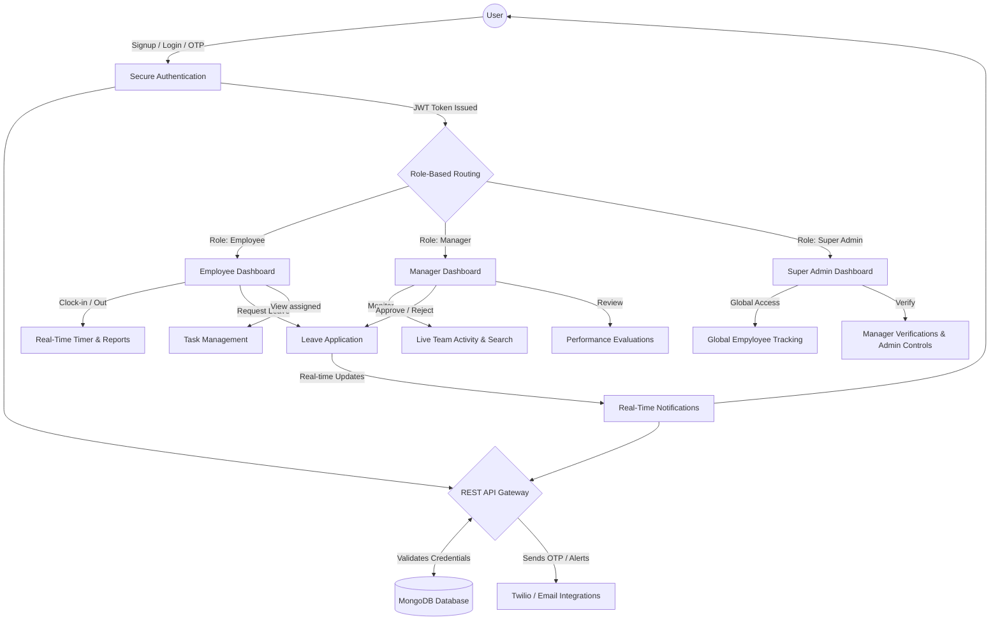

# 🚀 Premium Employee Management Portal - Demo Document

Welcome to the **Employee Management System** documentation, designed specifically for our upcoming client demo. This document provides a comprehensive overview of the application flow, its robust architecture, and all the critical features implemented to deliver a premium, end-to-end corporate management solution.

---

## 🏗️ System Architecture & Data Flow

The platform utilizes a modern client-server architecture. Below is a high-level flowchart depicting how an end-user traverses the system:

---

## 🌟 Key Features & Demonstrable Modules

### 1. 🔐 Security & Secure Login (Auth Suite)
*   **Multi-Factor Authentication (OTP):** Integration setup with Twilio (SMS) and Nodemailer (Email) to verify identities securely.
*   **Role-Based Access Control (RBAC):** Users are intelligently routed to `Employee`, `Manager`, or `Super Admin` dashboards depending on their organizational hierarchy.
*   **Glassmorphic UI:** Smooth micro-animations and a premium aesthetic ensure the signup/login flow is stunning.

### 2. 👩‍💻 Employee Dashboard & Self-Service
*   **Real-time Attendance Tracker:** Employees can seamlessly Clock-in and Clock-out. A built-in real-time timer correctly handles breaks and elapsed work durations.
*   **Leave Management:** Direct leave applications trigger immediate system notifications to connected managers.

### 3. 👔 Manager Workspace
*   **Real-time Dashboard Search:** A powerful, instant search function filters through team activity, historical leave requests, and performance metrics dynamically as the user types.
*   **Leave Approvals:** Managers can instantly process leave requests. Real-time notifications (and auto-deleting read notifications) maintain a clean and responsive approval inbox.
*   **Team Activity:** Live tracking of who is currently working, on break, or absent.

### 4. 👑 Super Admin Control Center
*   **Global Oversight:** Absolute visibility over all company branches, managers, and underlying employees.
*   **System Controls:** Ability to verify newly created manager accounts before they obtain executive access on the system.

### 5. ⚡ Real-Time Notification Ecosystem
*   **Instant Sync:** The system heavily utilizes real-time features. E.g., changing a leave status instantly emails the employee and triggers an in-app alert.
*   **Smart Cleanup:** Notifications automatically resolve/delete once they are clicked or read, ensuring a clutter-free experience.

---

## 🛠️ Technology Stack Breakdown

*   **Frontend Ecosystem:** 
    *   *Technologies*: HTML5, Vanilla CSS, Tailwind CSS (for flexible utilities), and TypeScript.
    *   *Focus*: Responsive, dynamic, glassmorphic UI avoiding heavy frontend frameworks to maximize raw performance and bundle simplicity.
*   **Backend Engine:**
    *   *Technologies*: Node.js, Express.js, TypeScript.
    *   *Focus*: Type-safe API structures managing high-traffic real-time calls.
*   **Database:** 
    *   *Technologies*: MongoDB and Mongoose (ODM).
*   **3rd Party Integrations:**
    *   *Twilio*: Secure SMS alerts and verifications.
    *   *Nodemailer*: Email delivery system.

---

## 🎬 How to Run the Demo for the Client

1. **System Startup:** Ensure the local server is running by executing `npm run dev` in the terminal. The app compiles both TypeScript frontend/backend.
2. **Access the App:** Open a web browser to `http://localhost:5000` (or the configured port).
3. **Showcase Auth:** Walk the client through the visually pleasing registration/login screen. Demonstrate an OTP request.
4. **Showcase Roles:**
    *   **Login as an Employee:** Show the real-time clock timer. 
    *   **Login as a Manager (side-by-side):** Show the real-time updates and search functionality. Apply for leave on the employee side, and show the instant notification pop-up on the manager side.
5. **Showcase Admin:** Complete the loop by briefly showing the overall metrics handled by a Super Admin log-in.

*End of Document*
